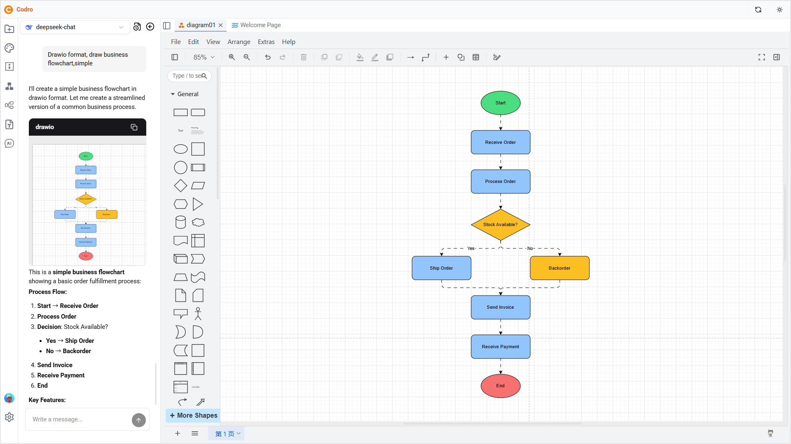

  

<h2 align="center"/>Codro</h2>

   
  <em>思考と描画のAIワークスペース。</em>
   
   

[![アプリバージョン][version-badge]][release]
[![ダウンロード数][downloads-badge]][release]
[![閉じた問題][issues-closed]](https://github.com/cozeed/codro/issues?q=sort%3Aupdated-desc+is%3Aissue+is%3Aclosed)  
[![TypeScript バージョン][typescript-version-icon]](https://www.typescriptlang.org/)
[![Rust バージョン][rust-version-icon]](https://www.rust-lang.org/)
[![ライセンス][license-badge]][license]

 

<h4 align="center"><strong>English</strong> | <a href="./README_JA.md">日本語</a> | <a href="./README_CN.md">简体中文</a> | <a href="./README_TW.md">繁体中文</a></h4>

## オンラインで試す

- ユーザー名：`test@test.com`
- パスワード：`11111111`

## Codroは現在Beta段階 ⚠️

現在、Codroはベータ段階にあります。データバックアップがある状態での使用をお勧めします。

## 機能

- 🖥️ **ローカル優先（Local-first）：** すべてのデータはローカルに保存され、オフラインでの利用が可能で、デバイス間で同期できます。
- 🎨 **利用シーン：** ホワイトボードや自由描画、フローチャート、シーケンス図、アーキテクチャ図、図解、マインドマップなどに対応。さらに、構造化されたノートやドキュメント編集にも対応しています。
- 🤖 **AIチャット：** チャットを通じてAIアシスタントと対話可能。OpenAI、Anthropic、Google、DeepSeek などのモデルに対応。
- 📊 **図表タイプ：** Excalidraw、tldraw、draw.io、マインドマップ、ノートなど、さまざまな図表形式に対応。
- ⚡ **軽量設計：** Tauri を採用し、インストールサイズは20MB未満。高いパフォーマンスを実現。
- 🌍 **多言語対応：** 英語、日本語、簡体字中国語、繁体字中国語に対応。
- 💻 **クロスプラットフォーム：** Web、Windows、macOS、Linux で利用可能。

## ドキュメント

- [クイックスタート](https://cozeed.com/docs/quickstart)
- [プロジェクトアーキテクチャ](https://cozeed.com/docs/architecture)
- [プロジェクト構造](https://cozeed.com/docs/development/project-structure)
- [設定管理](https://cozeed.com/docs/development/configuration)
- [Docker デプロイ](https://cozeed.com/docs/deployment/docker)

## どう貢献するか

現在Codroは初期段階にあり、改善が必要な体験やバグがあるかもしれません。関心のある方や問題がある方は、[issues](https://github.com/cozeed/codro/issues/new)や[PR](https://github.com/cozeed/codro/compare)を送って、プロジェクトに参加してください。

## サポート

Codroは完全にオープンソースであり、永続的に無料で利用できます。Codroをサポートしたい場合は、このプロジェクトに`star`を付けてください。特別なサポートが必要な場合は、[email](mailto:cozeed9@gmail.com)でご連絡ください。

<!-- badges -->

[downloads-badge]: https://img.shields.io/github/downloads/cozeed/codro/total?label=downloads&style=flat-square&labelColor=black
[license-badge]: https://img.shields.io/badge/license-AGPL-purple.svg?style=flat-square&labelColor=black
[license]: https://opensource.org/licenses/AGPL-3.0?labelColor=black
[release]: https://github.com/cozeed/codro/releases?labelColor=black
[version-badge]: https://img.shields.io/github/v/release/cozeed/codro?color=%239accfe&label=version&style=flat-square&labelColor=black
[rust-version-icon]: https://img.shields.io/badge/Rust-1.95.0-dea584?style=flat-square&labelColor=black
[typescript-version-icon]: https://img.shields.io/github/package-json/dependency-version/cozeed/codro/dev/typescript?label=TypeScript&style=flat-square&labelColor=black
[issues-closed]: https://img.shields.io/github/issues-closed/cozeed/codro.svg?style=flat-square&labelColor=black

## ライセンス

Codroは[AGPL-3.0](LICENSE)ライセンスのもとで提供され、所有権は[Cozeed.com](https://cozeed.com)に帰属します。

## Star履歴

